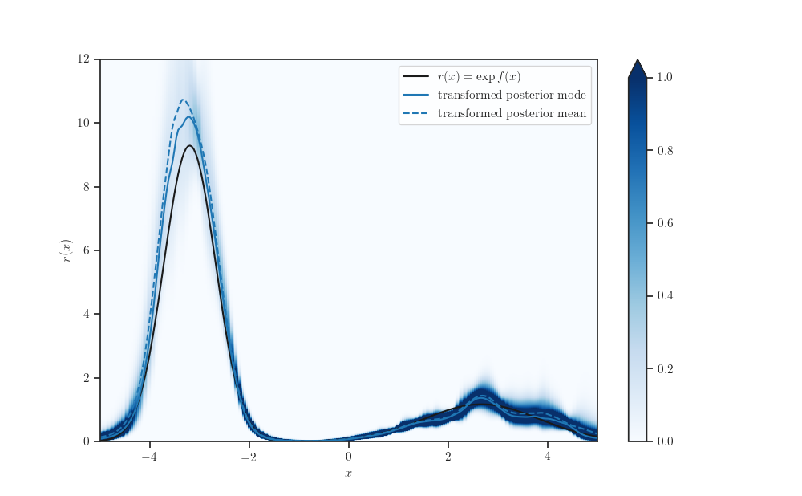

=========================================
Gaussian Process Density Ratio Estimation
=========================================

.. image:: https://img.shields.io/pypi/v/gpdre.svg
        :target: https://pypi.python.org/pypi/gpdre

.. image:: https://img.shields.io/travis/ltiao/gpdre.svg
        :target: https://travis-ci.com/ltiao/gpdre

.. image:: https://readthedocs.org/projects/gpdre/badge/?version=latest
        :target: https://gpdre.readthedocs.io/en/latest/?badge=latest
        :alt: Documentation Status

.. image:: https://pyup.io/repos/github/ltiao/gpdre/shield.svg
     :target: https://pyup.io/repos/github/ltiao/gpdre/
     :alt: Updates

A toolkit for Gaussian Process (GP)-based Density Ratio Estimation.

|splash|

* Free software: MIT license
* Documentation: http://gp-dre.s3-website.eu-central-1.amazonaws.com

